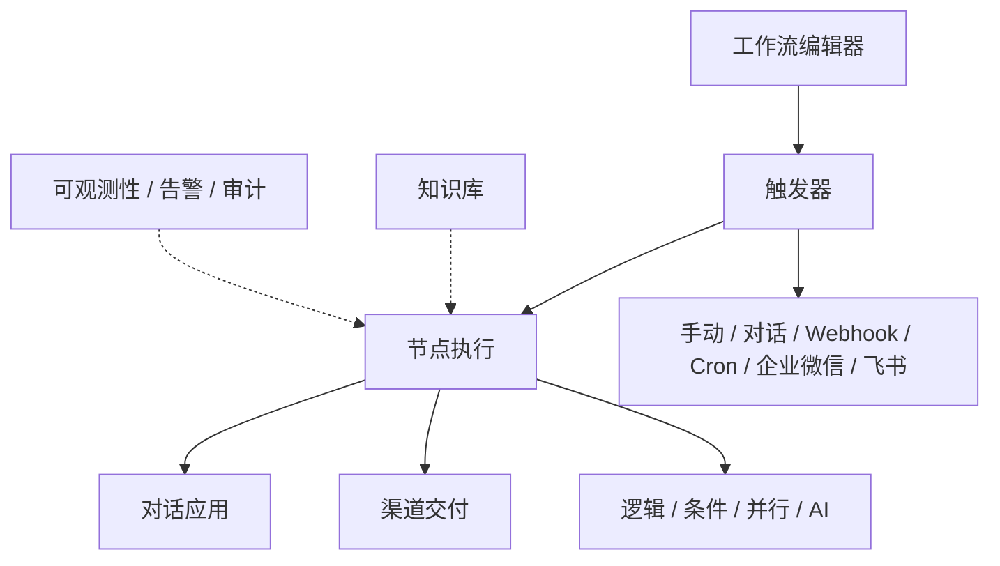
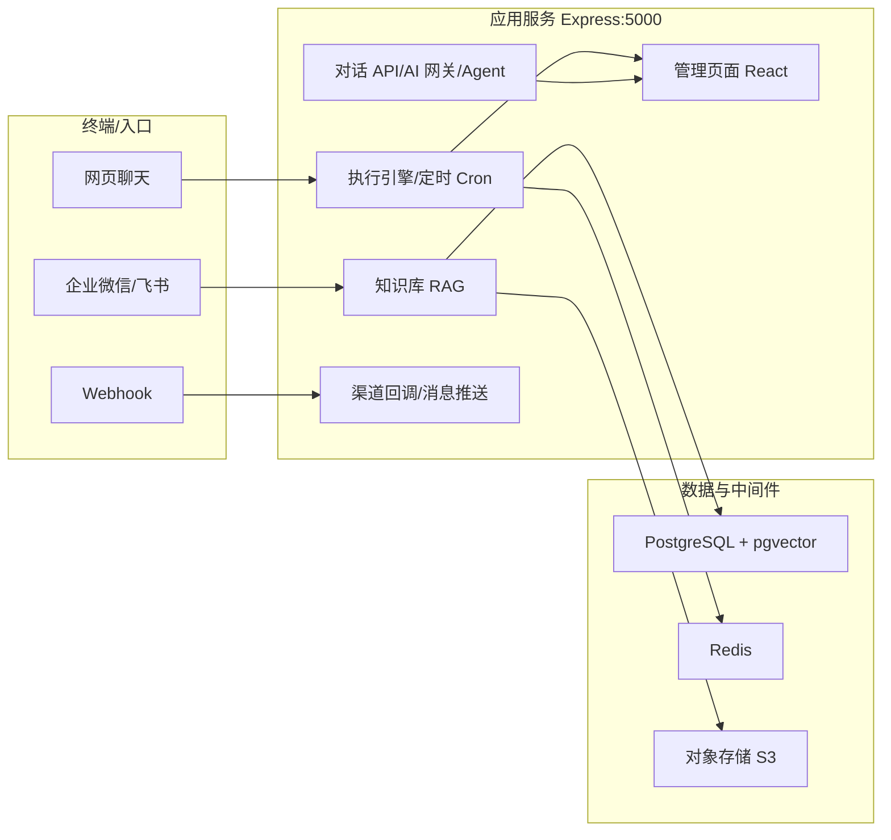

# PlantFlow（厂流）社区版

> 可视化工作流编排 + AI 知识库 + 对话应用 —— 面向工厂 / 企业内部的自动化平台。
> 可理解为 **n8n（流程）+ Dify（AI 应用）** 的开源实现；单进程架构，一个服务同时托管 API（`/api/*`）与前端（`dist/`）。

[](LICENSE)
[](#)
[](#)
[](#)
[](#)
[](#)

---

## 为什么选择 PlantFlow

- **一条命令开箱即用**：`docker compose -f docker-compose.fullstack.yml --env-file .env.fullstack up -d --build` 拉起 应用 + PostgreSQL（内置 pgvector）+ Redis，无需手动装任何依赖。
- **单进程即全栈**：Express 同时托管后端 API 与编译后的前端页面，域名只需反代到 `127.0.0.1:5000` 即可。
- **AI 能力开箱可用**：对话、知识库 RAG、Agent（工具调用）；模型网关 OpenAI 兼容，可接入任意模型；pgvector 让向量检索立即可用。
- **多触发与多渠道**：手动 / 对话 / Webhook / 定时 Cron / 企业微信 / 飞书。
- **私有部署可控**：单租户、MIT 协议、免费自部署；支持 Docker、手动、宝塔 / Nginx 反代；可导出镜像离线部署。
- **单企业 + 邀请制**：不开放自助注册，管理员在「账号设置 → 邀请员工」生成邀请链接，员工通过链接加入。

---

## 核心能力

```
拖拽编排 → 触发（对话/Webhook/Cron/企微/飞书） → 节点执行（逻辑/条件/并行/AI） → 渠道交付
```



---

## 系统架构



---

## 技术栈

| 层 | 技术 |
|----|------|
| 前端 | React 18 · React Flow（@xyflow/react）· React Router · Zustand · Tailwind CSS · Vite |
| 后端 | Express · TypeScript · node-cron |
| 文档解析 | mammoth（Word）· pdf-parse（PDF）· xlsx（Excel） |
| 数据库 / 缓存 | PostgreSQL 16（可选 pgvector）· MySQL（可选）· Redis |
| 文件 / 上传 | multer · @aws-sdk/client-s3（S3 兼容对象存储） |
| 通知 | nodemailer（邮件） |
| 部署 | Docker Compose · Nginx（宿主反代） |

---

## 快速开始

### 环境要求

| 方式 | 依赖 |
|------|------|
| Docker 一键部署 | Docker 20+ / Compose v2（推荐，内置数据库全部就绪） |
| 本地开发 | Node.js 22+ · PostgreSQL 14+（推荐 16 + [pgvector](https://github.com/pgvector/pgvector)）· Redis 6+ |

### 方式一：Docker 一键启动（推荐，开箱即用）

内置 **应用 + PostgreSQL（pgvector）+ Redis** 三个服务，无需手动装库：

```bash
# 1) 生成部署环境变量，然后编辑 .env.fullstack 必填 POSTGRES_PASSWORD、LLM_MASTER_KEY
cp .env.fullstack.example .env.fullstack
#    LLM_MASTER_KEY 生成：openssl rand -hex 32

# 2) 一键构建并启动
docker compose -f docker-compose.fullstack.yml --env-file .env.fullstack up -d --build
```

- **首次启动自动执行数据库迁移并创建演示数据**，无需额外初始化。
- 访问：`http://127.0.0.1:5000`（或你反向代理的域名，见 §绑定域名与 HTTPS）。
- 若 `POSTGRES_PASSWORD` 或 `LLM_MASTER_KEY` 未填写，命令会直接报错提示，属正常保护行为，填入即可。

| 服务 | 默认对外端口（可在 `.env.fullstack` 覆盖） |
|------|-------------------------------------------|
| 应用 | `FS_APP_PORT=5000` |
| PostgreSQL（内置 pgvector，知识库向量检索开箱可用） | `FS_POSTGRES_PORT=5544` |
| Redis | `FS_REDIS_PORT=6383` |

常用运维命令（替换为上面同款 `-f` / `--env-file` 前缀）：

```bash
docker compose -f docker-compose.fullstack.yml --env-file .env.fullstack ps
docker compose -f docker-compose.fullstack.yml --env-file .env.fullstack logs -f app
docker compose -f docker-compose.fullstack.yml --env-file .env.fullstack down
```

**无外网 / 内网离线部署**：在可联网机器上构建后导出镜像，目标机导入即可，无需再联网拉取：

```bash
bash docker/fullstack/export-fullstack.sh           # 自动导出全部镜像到 tar.gz
docker load < plantflow-fullstack_*.tar.gz          # 目标机导入
docker compose -f docker-compose.fullstack.yml --env-file .env.fullstack up -d
```

> **传统方式（可选）**（应用连接你自建的宿主 PostgreSQL / Redis，需先建库并令 `.env` 中 `DATABASE_URL` / `REDIS_URL` 用 `host.docker.internal` 指向宿主机服务）：
>
> ```bash
> docker compose build
> docker compose up -d
> ```

### 方式二：本地开发

```bash
npm install
npm run dev            # 前端 Vite 热重载 + 后端 nodemon，一条命令
# 或分别运行：
npm run client:dev     # 前端 Vite
npm run server:dev     # 后端 nodemon
```

生产构建与启动：

```bash
npm run build          # 编译后端(dist-api) + 前端(dist)
npm run server:start   # 运行编译后的产物（Node dist-api/server.js）
```

---

## 绑定域名与 HTTPS（Docker 部署 · 可选）

后端已用单个 Express 服务**同时托管 API（`/api/*`）与前端页面（`dist/`）**，所以最简单做法是把**整个域名反代到 `127.0.0.1:5000`**，无需伪静态、无需分开绑目录。

- **宝塔面板**：DNS 把域名 A 记录指向服务器 IP → 网站 → 添加站点绑定域名 → 「反向代理 / 高级设置」填目标 `http://127.0.0.1:5000` → 站点 SSL 申请 Let's Encrypt 证书并强制 HTTPS。
- **系统 Nginx**：

```nginx
server {
    listen 80;
    server_name api.example.com;

    # WebSocket 支持（工作流实时通信 / 对话流）
    proxy_set_header Upgrade $http_upgrade;
    proxy_set_header Connection "upgrade";

    location / {
        proxy_pass http://127.0.0.1:5000;
        proxy_http_version 1.1;
        proxy_set_header Host              $host;
        proxy_set_header X-Real-IP         $remote_addr;
        proxy_set_header X-Forwarded-For   $proxy_add_x_forwarded_for;
        proxy_set_header X-Forwarded-Proto $scheme;
    }
}
```

反代后健康检查：

```bash
curl -s https://api.example.com/api/health
# → {"success":true,"message":"ok","checks":{"database":true,"redis":true,...}}
```

---

## 默认演示账号

| 字段 | 值 |
|------|-----|
| 邮箱 | `admin@example.com` |
| 密码 | `admin123` |

**首次登录后请立即修改密码。** 生产环境务必更换演示账号与所有密钥。

> **账号说明**：本系统为「单企业 + 邀请制」，不开放自助注册。企业管理员登录后，在「账号设置 → 邀请员工」生成邀请链接，员工通过链接注册加入企业。

---

## 常用配置（`.env` / `.env.fullstack`）

| 变量 | 说明 |
|------|------|
| `DATABASE_URL` | PostgreSQL 连接串 |
| `REDIS_URL` | Redis 连接串 |
| `LLM_MASTER_KEY` | 32 字节十六进制，用于加密存储的 LLM API Key（必填，`openssl rand -hex 32` 生成） |
| `WORKER_CONCURRENCY` | 工作流执行并发数 |
| `PORT` | 服务端口，默认 5000 |
| `FS_APP_PORT` / `FS_POSTGRES_PORT` / `FS_REDIS_PORT` | 全栈一键部署的对外端口（仅 `.env.fullstack`） |

在 **AI · 模型** 页面配置大模型网关（OpenAI 兼容）。知识库向量检索需网关支持 `POST /v1/embeddings`。

---

## 项目结构

```
plantflow-community/
├── api/                  # Express 后端、数据库迁移(migrations/)、工作流执行引擎
├── src/                  # React 前端（Vite）
├── public/               # 静态资源
├── docs/                 # 学习手册 / 用户操作手册 / 管理部署手册（.md / .pdf / .html）
├── docker/
│   ├── fullstack/            # 全栈一键部署
│   │   ├── app.Dockerfile        # 应用镜像（多阶段 Node 构建，含国内 npm 镜像加速）
│   │   ├── env.fullstack.example # 全栈部署环境变量模板
│   │   └── export-fullstack.sh   # 离线镜像导出脚本
│   └── ...
├── docker-compose.fullstack.yml  # 全栈一键部署（内置 PostgreSQL + Redis）
├── docker-compose.yml            # 传统部署（连接宿主数据库）
├── Dockerfile
└── README.md
```

---

## 文档

- [平台学习手册（Markdown）](docs/平台学习手册.md)
- [平台学习手册（网页版）](docs/平台学习手册.pdf)
- [用户操作手册（网页版）](/docs/guide-user.html) —— 工作流编辑、知识库、对话应用、渠道接入全面指南
- [管理部署手册（网页版）](/docs/guide-admin.html) —— 宝塔 / 原生 / Docker 部署、系统管理、备份恢复、排错

构建后文档可通过 `https://你的域名/docs/guide-user.html` 和 `https://你的域名/docs/guide-admin.html` 访问。

---

## 开源版 vs 商业版

| 能力 | 开源版（本仓库） | 商业版 |
|------|-----------------|--------|
| 协议 | MIT（免费） | 商业授权 |
| 租户模型 | 单租户 | 多租户 |
| 计费钱包 / 套餐订阅 | ❌ | ✅（虎皮椒 / 微信 / 支付宝） |
| 平台运营管理 | ❌ | ✅（租户管理、账单流水） |
| 获取方式 | 直接 clone | 付费授权（私有交付 + 12 个月更新支持） |

需要商业版（多租户 + 计费系统 + 平台运营）请联系：contact@cenkor.cn

---

## 贡献

欢迎提交 Issue 与 Pull Request。请遵循既有代码风格，并在修改后运行类型检查与 Lint：

```bash
npm run check   # tsc --noEmit
npm run lint    # eslint
```

---

## 安全提示

- **切勿**将 `.env` 或 `.env.fullstack` 提交到 Git（`.gitignore` 已忽略）。
- 生产环境务必设置固定强密钥：`LLM_MASTER_KEY`（≥32 字节）、数据库密码、Redis 密码。
- 若密钥曾泄露，请轮换：`LLM_MASTER_KEY`、数据库密码、Redis 密码、所有 LLM API Key。
- 生产环境使用 HTTPS，限制管理后台访问。

---

## 许可证与致谢

本项目采用 **MIT License** 开源协议，详见 [LICENSE](LICENSE)。可自由使用、修改、商用，保留版权声明即可。

PlantFlow 构建于众多优秀开源项目之上。我们对以下第三方技术与组件致以谢意，并严格按其上游许可证分发、保留版权声明：

### 后端 / 运行

| 技术 | 官方站点 | 许可证 |
|------|----------|--------|
| Express | https://expressjs.com/ | MIT |
| TypeScript | https://www.typescriptlang.org/ | Apache-2.0 |
| pg（node-postgres） | https://node-postgres.com/ | MIT |
| mysql2 | https://github.com/sidorares/node-mysql2 | MIT |
| redis（node-redis 客户端） | https://redis.io/ | MIT |
| multer | https://github.com/expressjs/multer | MIT |
| node-cron | https://github.com/node-cron/node-cron | ISC |
| nodemailer | https://nodemailer.com/ | MIT |
| cors | https://github.com/expressjs/cors | MIT |
| dotenv | https://github.com/motdotla/dotenv | BSD-2-Clause |
| bcryptjs | https://github.com/dcodeIO/bcryptjs | MIT |
| AWS SDK for JavaScript | https://aws.amazon.com/sdk-for-javascript/ | Apache-2.0 |

### 文档解析

| 技术 | 官方站点 | 许可证 |
|------|----------|--------|
| mammoth（Word → HTML） | https://github.com/mwilliamson/mammoth.js | BSD-2-Clause |
| pdf-parse（PDF 文本） | https://www.npmjs.com/package/pdf-parse | MIT |
| xlsx（SheetJS） | https://github.com/SheetJS/sheetjs | Apache-2.0 |

### 前端

| 技术 | 官方站点 | 许可证 |
|------|----------|--------|
| React | https://react.dev/ | MIT |
| React Flow（@xyflow/react） | https://reactflow.dev/ | MIT |
| React Router | https://reactrouter.com/ | MIT |
| Zustand | https://zustand.docs.pmnd.rs/ | MIT |
| Tailwind CSS | https://tailwindcss.com/ | MIT |
| Vite | https://vitejs.dev/ | MIT |
| lucide-react | https://lucide.dev/ | ISC |
| clsx | https://github.com/lukeed/clsx | MIT |
| tailwind-merge | https://github.com/dcastil/tailwind-merge | MIT |

### 数据 / 部署

| 技术 | 官方站点 | 许可证 |
|------|----------|--------|
| PostgreSQL | https://www.postgresql.org/ | PostgreSQL License |
| pgvector | https://github.com/pgvector/pgvector | PostgreSQL License |
| MySQL | https://www.mysql.com/ | GPLv2 / 商用 |
| Redis | https://redis.io/ | BSD-3-Clause |
| Docker / Moby | https://www.docker.com/ | Apache-2.0 |
| Nginx | https://nginx.org/ | BSD-2-Clause |

> 完整、逐条目的第三方依赖清单与许可证信息，请参阅 [LICENSE](LICENSE) 及各上游项目仓库。